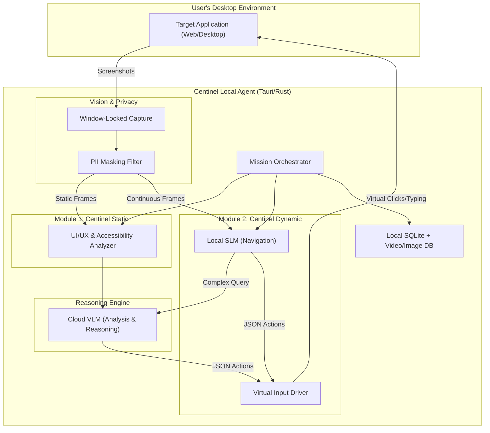

# PRD: Centinel - Autonomous AI QA Agent

## 1. Summary
Centinel is a locally installed application that uses Vision-Language Models (VLMs) to autonomously assess Web and Desktop applications. To serve distinct testing needs, Centinel is divided into two main modules:
- **Module 1: Centinel Static (Static Testing):** Focuses on single-screen analysis, UI/UX audits, accessibility checks, and design system compliance without executing user flows.
- **Module 2: Centinel Dynamic (Dynamic Testing):** Focuses on autonomous navigation, end-to-end (E2E) functional testing, and complex user journey validation.

## 2. Contacts
- **Product Manager:** Gemini CLI (Strategic Lead)
- **Lead Engineer:** [To be assigned]
- **Stakeholder:** User (Idea Visionary)

## 3. Background
Traditional automated testing is brittle, requiring significant coding and maintenance. With advances in VLMs (like GPT-4o or Claude 3.5), AI can now "see" and "interact" with screens like a human. Different teams have different testing needs: developers and designers need immediate feedback on UI/UX and accessibility (Static), while QA teams need robust, resilient functional testing across full user journeys (Dynamic). Splitting Centinel into two modules addresses these distinct needs efficiently.

## 4. Objective
- **Goal:** Provide zero-code, AI-driven testing solutions tailored for both rapid UI feedback and deep functional validation.
- **Key Result 1 (Static):** Developers can run a full UI/UX and accessibility audit on a single screen in under 10 seconds.
- **Key Result 2 (Dynamic):** Users can start their first autonomous E2E "Mission" in under 2 minutes after installation.
- **Key Result 3 (Overall):** Achieve a 40% "Valid Bug" rate (Developer/QA confirmation) across both modules within the first 3 months.

## 5. Market Segment(s)
The dual-module approach targets two distinct markets:
### 5.1 Centinel Static (Static Testing Module)
- **Target Audience:** Frontend Developers, UI/UX Designers, and Compliance/Accessibility Teams.
- **Use Case:** Rapid feedback during the development cycle, PR reviews, design system enforcement, and WCAG compliance checks.

### 5.2 Centinel Dynamic (Dynamic Testing Module)
- **Target Audience:** QA Engineers, SDETs (Software Development Engineers in Test), and Product Managers.
- **Use Case:** Pre-release regression testing, autonomous exploratory testing, smoke tests, and complex state-machine validation.

## 6. Value Proposition(s)
- **For Developers/Designers (Static):** Instant, human-like visual and structural feedback. Catch accessibility and alignment issues before they hit staging.
- **For QA Teams (Dynamic):** Zero-code functional testing. No more brittle selectors or XPaths. Tests don't break when the underlying HTML structure changes, as long as the UI looks the same.
- **General:** Secure, local-first processing that respects corporate security policies regarding screen recording and PII.

## 7. Solution

### 7.1 Technical Architecture
Centinel uses a "Sidecar Agent" pattern to interact with the target application securely.

### 7.2 Key Features
**Module 1: Centinel Static**
- **Single-Screen Audit:** Upload a screenshot or point to a URL for instant UI/UX and Accessibility analysis.
- **Design System Diffing:** Compare current UI against Figma mockups or expected design tokens.

**Module 2: Centinel Dynamic**
- **Autonomous Missions:** Select from "Smoke Test," "Regression," or "Exploratory" missions.
- **Frustration Heatmap:** Highlights areas where the AI agent "hesitated" or performed redundant clicks.
- **Session Bundles:** Auto-generates videos, console logs, and reproducible markdown bug reports.

## 8. Security & Privacy
- **Local-First Processing:** Image masking and basic navigation happen on the user's machine.
- **Encrypted Storage:** Test artifacts are stored in an encrypted local directory.
- **Data Masking:** Blurs PII (passwords, credit cards) before frames hit the Cloud VLM.

## 9. Success Metrics
- **Static Module:** < 10 seconds processing time per screen audit.
- **Dynamic Module:** Mean Time to Bug Discovery (MTBD) < 5 minutes for "Critical" UI bugs.
- **False Positive Rate:** < 15% (AI-flagged "bugs" that are intentional design).

## 10. Release Plan (Phases)
- **V1 (MVP):** Web-only testing. Launch Centinel Static for basic accessibility/UI audits and Centinel Dynamic for simple "Smoke Test" web missions.
- **V2:** Desktop application support. Advanced Dynamic missions (handling complex auth flows, deep state exploration).
- **V3:** Team features (Syncing reports, CI/CD integration, custom design system rules for Static testing).

## 11. User Stories (V1 Focus)

### 11.1 Static Testing (Developers & Designers)
**Description:** As a Frontend Developer, I want to run a "Static UI Audit" on my current localhost screen, so that I can catch contrast, padding, and accessibility issues instantly.
**Acceptance Criteria:**
- User can capture the current screen state.
- System returns a marked-up image highlighting UI/UX/A11y violations within 10 seconds.

### 11.2 Dynamic Testing (QA Engineers)
**Description:** As a QA Engineer, I want the agent to autonomously explore my web app (Dynamic Mission), so that it can find functional bugs and broken links without a predefined script.
**Acceptance Criteria:**
- Agent identifies clickable elements and navigates >3 levels deep.
- Generates a Markdown report with videos and reasoning for discovered bugs.

### 11.3 Privacy Safeguards (Both Modules)
**Description:** As a Security-conscious User, I want my personal data masked automatically across both Static and Dynamic tests.
**Acceptance Criteria:**
- System blurs PII locally before sending frames to the Cloud VLM.