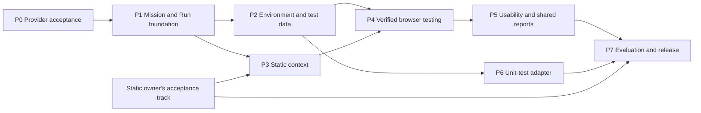

# Centinel Development Plan

**Planning baseline:** 7 October 2026

**Status:** proposed delivery plan; estimates and release defaults are recommendations, not confirmed deadlines

**Scope:** full project coordination, with detailed execution planning for JY's Dynamic module

**Authority:** [DESIGN.md](../DESIGN.md) → [PRD](Centinel_PRD_Revised.md) → current feature specifications → technical contracts

## 1. Recommended direction

Finish and accept the shared Codex/provider foundation first. Then deliver one
repeatable, evidence-verified browser mission through the same project identity
and durable records used by Review. Expand that working path into environment
profiles, Static context, exploratory/regression testing, usability, shared
reports and a separate unit-test runner. Evaluate continuously and finish with
release acceptance against a frozen application/data baseline.

A functioning browser agent is the starting point. The next product milestone
is a test whose inputs, checks, verdict, evidence and rerun history can be trusted.
Native desktop testing stays outside the required release until all core gates
pass and the team explicitly schedules it.

[PROJECT_PLAN.md](../PROJECT_PLAN.md) is historical. Its fixed MiniMax/Gemini
choices, SQLite-first authority and optional collaboration are superseded by the
PRD. This plan preserves API-provider choice, bearer-scoped Supabase authority,
local execution and required member access to results/evidence.

## 2. Current baseline and remaining work

The planning baseline includes commit `5744279` (PRD) and the shared
Codex/provider implementation developed on `codex/shared-codex-provider`. The
user subsequently authorized committing, publishing and merging this foundation
into the default branch (`main`, not `master`). Git/PR history identifies the
integrated revision; integration does not mark the pending live acceptance gates
complete. Future commits and outward-facing actions still require authorization.

| Area | Current evidence | Remaining gate |
| --- | --- | --- |
| Codex provider | Settings connection/model selection, text/image transport, isolated local account credentials, cancellation and HTTP tests exist. Real CLI initialization/account-read succeeded. | Real ChatGPT login, text/image generation and complete Review/Dynamic executions. See [integration record](CODEX_PROVIDER.md). |
| Shared model foundation | Configured API/Codex adapters, authenticated settings and usage ledger wiring exist. | Live provider/account limits, unsuccessful/retried-call accounting, refreshed/expired bearer behavior and packaged launch acceptance. |
| Dynamic prototype | URL/goal input, smoke/journey mode, Playwright loop, screenshots, traces, cancellation and local summaries exist. | Mission revisions, independent checks, policy enforcement, environment/data lifecycle and durable reconciliation. |
| Honest failures | Provider/runtime errors become blocked; cancellation aborts active work; duplicate finding creation was removed. | `finish_success` still finalizes success in the runner; failed-goal findings still use fixed severity/confidence and lack independent verification. |
| Persistence and access | Dynamic routes/files check shared membership; new shared projects can acquire an additive local workspace pointer. | Dynamic records/findings/evidence remain local. Membership checks do not establish cloud synchronization, RLS/Storage acceptance or restart recovery. Duplicate-start handling still needs an atomic contract. |
| Review platform | Supabase repositories, sources, review decisions, traceability, risk/report services and acceptance documents exist. | Static owner must recheck current live acceptance; September audits are historical and must not be treated as current failures or current completion. |

The preceding implementation reported 325 sidecar tests, 172 frontend tests,
TypeScript/build checks and three viewport checks passing. Those are recorded
local checks, not new tests run for this plan or proof of live authentication,
Storage access, migration safety or final product acceptance.

## 3. Delivery order, dependencies and effort

Each phase ends with a small demonstrable workflow and retained acceptance
results. Create bounded feature specifications/tasks before implementation;
record status as planned, implemented, locally verified, live accepted or blocked.
Do not mark a phase complete just because its code merged.

| Phase | Deliverable | Lead and coordination | Dependencies | Rough effort |
| --- | --- | --- | --- | --- |
| P0 | Accept shared Codex/API foundation and freeze initial contracts | JY + Static owner | Current working changes | 1–2 days |
| P1 | Mission/Run records, shared persistence, safe lifecycle and first verified check | JY; shared schema review | P0 | 4–6 days |
| P2 | Environment profiles, variables, preflight and test-data lifecycle | JY; shared credential boundary | P1 | 4–6 days |
| P3 | Versioned Static-to-Dynamic context and criterion coverage | JY + Static owner | P1; Static export contract | 2–4 days |
| P4 | Reliable browser execution, exploration and regression | JY | P1–P2; P3 for linked requirement coverage | 5–8 days |
| P5 | Usability, reviewable findings, shared evidence and reports | JY; shared findings/report review | P3–P4; P1 private storage | 5–8 days |
| P6 | Existing unit-test framework adapter | JY | P1–P2; can overlap P3–P5 | 3–5 days |
| P7 | Repeated evaluation, packaged acceptance and release evidence | Both | All required phases + Static track | 5–8 days |
| Extension | Native desktop test adapter | JY; separately scheduled | Core release accepted | Not estimated until OS/app chosen |

Estimates are engineering days for the Dynamic/shared slices: **29–47 days**
with one Dynamic developer, before unexpected platform repairs, external waiting
and contingency. They exclude the Static owner's independent implementation.
Plan roughly **8–12 calendar weeks** if JY works close to full time and shared
reviews/live services are available; part-time availability changes that range.
No submission date or weekly capacity has been supplied, so this is sequencing
and sizing rather than a calendar commitment. Re-estimate after P0 and P1.

Define the evaluation application, seed defects and basic scenarios in P0.
Grow that corpus with every phase; P7 consolidates evidence instead of starting
all testing at the end. Report/evidence schemas are agreed in P0/P1 even though
the complete report workflow lands in P5.

## 4. Phase work and exit gates

### P0 — Accept the provider foundation

**Tasks**

- P0.1 Review and integrate the provider/shared-runtime foundation under the
  authorized change. Record the integration revision and retained validation
  evidence; do not discard existing local data.
- P0.2 Run real Codex browser sign-in, model catalog, text and screenshot tests.
  Run one real Review and one safe Dynamic journey; also exercise API mode.
- P0.3 Exercise disconnected/expired auth, unavailable model/CLI, provider limits,
  cancellation while active/queued and restart/reconnect. Check both Centinel
  bearer identity and the separate local Codex connection.
- P0.4 Agree versioned Mission/Run/check/finding/evidence/report contracts and
  role permissions with the Static owner. Select a small authorized evaluation
  app, record its version and create normal, seeded-defect and blocked cases.
- P0.5 Record packaged-launch CLI discovery requirements; a CLI launched from a
  developer terminal does not establish Tauri installation readiness.

**Exit gate:** actual API and Codex text/image calls work through the configured
adapter; each backend completes an inspected journey with evidence; error/cancel
paths have recorded outcomes. If live credentials or services are unavailable,
record that blocker and proceed with independent contract/fixture work without
labeling provider integration accepted. Model-declared success remains provisional
until P1's independent check is in place.

### P1 — Mission/Run, persistence and trustworthy lifecycle

**Tasks**

- P1.1 Specify `Mission`, immutable `MissionRevision`, `Run`, `CheckResult`,
  `EvidenceManifest` and audit records. Separate execution state, check verdict,
  finding verification and remediation. Add optional/new fields without breaking
  existing session endpoints or Review contracts.
- P1.2 Implement a Dynamic repository boundary. Make shared metadata, decisions
  and findings authoritative in bearer-scoped Supabase; keep browser processes
  and recoverable temporary evidence local. Use additive migrations and private
  Storage policies; preserve historical SQLite data and mark unverified legacy
  fields unavailable. Make migration/import repeatable and separately authorized.
- P1.3 Add atomic start idempotency, per-project/run execution locks, ownership,
  heartbeats/lease expiry and startup reconciliation. Double-clicking Start
  creates one Run; process interruption cannot leave a false running/pass state.
- P1.4 Persist evidence manifests with hashes, upload state and authorized access.
  Failed upload retains recoverable local evidence and shows incomplete sharing.
  Reuse the existing Review refresh/recovery patterns only after checking their
  applicability; do not share a stale user's client or execution lease.
- P1.5 Implement one deterministic criterion (visible text or expected URL) and
  an independent checker. A model's terminal proposal cannot finalize a pass.
  Incomplete required checks stay uncertain/not tested. Failed checks create
  candidate observations, without invented severity or confirmation.
- P1.6 Add the basic code-enforced action/origin/workspace policy before any
  automated setup command is introduced. Retain cancellation and partial evidence.

**Exit gate:** a new shared project owns one mission with two independently
recorded runs; a known pass and a seeded failed check are verified by evidence;
provider/browser errors remain blocked. Concurrent duplicate starts produce one
run. Restart reconciles interrupted work. An authorized second member can read
synced run metadata/evidence; a non-member cannot. Legacy data is still readable.

### P2 — Environment profiles and test-data lifecycle

**Tasks**

- P2.1 Save reusable profiles: target URL, allowed origins, account role/session
  reference, browser/viewport, required configuration and budgets. Freeze a
  sanitized profile snapshot per Run; store secret references, never raw values.
- P2.2 Compare variable names/prerequisites with `.env.example`, package scripts
  and explicit project metadata. Suggest local startup commands and missing
  names; never invent secret values or execute suggestions automatically.
- P2.3 Add preflight: target reachability, required configuration, account/session
  readiness, provider/model/image capability, authorized workspace and data lock.
  Missing prerequisites produce actionable blocked reasons before browser work.
- P2.4 Support manual preparation first, then explicitly configured setup/cleanup
  hooks. Record setup, run and cleanup outcomes separately. Restrict hooks to an
  authorized workspace, approved command definition, timeout and output budget;
  target-app content/model text cannot supply arbitrary shell commands.
- P2.5 Use run-specific data identifiers or an exclusive profile/data lock.
  Always attempt configured cleanup after success, failure or cancellation;
  persist cleanup errors and a recovery instruction. A pending cleanup lock
  cannot expire silently and expose dirty data as a clean initial state.
- P2.6 Redact seeded tokens/passwords and sensitive URLs in prompts, traces,
  screenshots where necessary, uploads and exports. If sensitive visual content
  cannot be safely captured, exclude/block it and disclose missing coverage.

**Exit gate:** repeat the same mission twice from a documented equivalent initial
state. Example: prepare a test account and a unique `qa_<runId>` item, execute the
journey, remove that run's item, and verify cleanup. Simulate missing variables,
unreachable target, cleanup failure and concurrent data reuse. Secrets do not
appear in retained or provider-bound observations. Cleanup failure does not
rewrite the functional check result, but blocks unsafe reuse until resolved.

### P3 — Static context and coverage

**Tasks**

- P3.1 Agree the export contract with the Static owner: project, Review/snapshot,
  approval state, source versions/hashes, requirements, acceptance criteria,
  prioritized risks, contradictions and extraction limitations.
- P3.2 Let users select criteria and edit a generated mission before execution.
  Preserve source references and the context snapshot in each mission revision
  and Run; reject cross-project or dangling references.
- P3.3 Show stale, conflicting, incomplete and unapproved context explicitly.
  Permit an explicit, attributable choice to use identified unapproved context
  without presenting it as approved. Later source updates do not rewrite history.
- P3.4 Add criterion-to-check mappings and a coverage denominator. Show passed,
  failed, blocked, uncertain, not-tested and excluded criteria with reasons;
  keep this distinct from Static implementation-completeness mappings.
- P3.5 Keep manual mission creation available when no usable Static snapshot is
  present. Test the consumer against a contract fixture while Static export is
  pending, and mark real cross-module acceptance pending until it is exercised.

**Exit gate:** select a real Review requirement, create a mission, execute it and
trace its check/evidence back to the exact source snapshot. Updating the source
flags stale context while retaining the earlier result; an old pass is not
counted as validation of the changed criterion.

### P4 — Browser execution, exploration and regression

**Tasks**

- P4.1 Split observation, planning, policy guard, action execution and checking
  into focused modules. Observe DOM/accessibility first, use screenshots where
  needed, and record coordinate fallback when a stable locator is unavailable.
- P4.2 Extend independent checks to supported text/URL/element/form-state outcomes;
  add relevant console/network observations. Re-observe after actions and require
  evidence for terminal decisions. Missing observability yields uncertainty.
- P4.3 Enforce origin policy for clicks, redirects, popups, downloads and uploads,
  plus configured destructive-action restrictions. A natural-language warning
  in the prompt is not the enforcement mechanism.
- P4.4 Bound steps, wall time, retries, provider calls and available usage budgets.
  Distinguish safe re-observation/retry from repeating non-idempotent submissions.
  Cancel active navigation, model calls and backoff; retain partial evidence.
- P4.5 Implement bounded exploratory missions with visited-state/action records,
  selected objectives and disclosed unvisited scope. Do not imply exhaustive
  exploration because a step budget was exhausted.
- P4.6 Implement saved-mission regression: pin mission revision and relevant
  environment/target version; create a new Run and relate repeated observations
  to earlier findings. A successful retest does not erase prior evidence.

**Exit gate:** normal and deliberately defective login/form/CRUD flows are
distinguished from provider outages, unreachable pages and ambiguous outcomes.
A misleading `finish_success` cannot bypass a required failed check. Unsafe
redirects/actions are stopped, repeated submissions are not blindly replayed,
and cancellation/restart retains accurate state. Exploration exposes gaps;
regression after a seeded fix preserves both runs and finding lineage.

### P5 — Usability, findings, collaboration and reports

**Tasks**

- P5.1 Start with a small explicit usability rule/persona set: labels, keyboard
  reachability, focus/feedback and error recovery for chosen journeys. Separate
  deterministic checks from subjective suggestions; persona simulation is not a
  real-user study or a claim of complete accessibility conformance.
- P5.2 Unify Review/Dynamic finding presentation and record expected/actual result,
  reproduction steps, evidence, category, severity, priority, confidence basis,
  verification decisions and remediation history. Correlate repeated observations.
- P5.3 Add attributable confirm/reject/needs-investigation review. Reuse shared
  role enforcement; do not invent a new owner/reviewer permission model silently.
  Keep Dynamic findings separately labeled in Project Assessment until an
  explicit, tested cross-module risk aggregation policy is accepted.
- P5.4 Finish private evidence sharing, upload recovery, retention handling and
  member/revocation tests. A second device can inspect fully synced results;
  local-only/incomplete uploads remain visibly unavailable there. Offline exports
  already downloaded by a recipient cannot be remotely revoked.
- P5.5 Generate versioned report snapshots, JSON plus Markdown/PDF using existing
  renderers where compatible. Include scope, source/target/environment versions,
  mission revision, checks, findings, actor/reviewer, setup/cleanup, untested areas,
  evidence availability and actual available usage. Validate export contents and
  links; do not treat a local summary file as complete shared reporting.
- P5.6 Apply DESIGN.md to complete Dynamic setup/activity/result views. Keep
  advanced controls/logs progressively disclosed, map statuses honestly and
  verify keyboard/focus and the required three viewport sizes.

**Exit gate:** a second authorized member can inspect, review and reproduce a
reported issue from its evidence/report. A non-member and revoked member cannot
retrieve protected metadata/files or start work. Usability findings expose their
rule/persona and evidence. Reports disclose omitted/unsynced evidence and preserve
snapshot history instead of silently changing after later runs.

### P6 — Separate existing unit-test execution

**Tasks**

- P6.1 Propose **Vitest** as the first supported target-project framework because
  the team already uses it; confirm this against the evaluation app in P0.
  This does not promise Jest, pytest or other framework support.
- P6.2 Implement a separate runner interface with authorized workspace, explicit
  executable/arguments, timeout, cancellation, bounded/redacted output and a
  machine-readable result parser. Do not pass a model-generated shell string
  through an unrestricted shell or auto-install target dependencies.
- P6.3 Record framework/version, command, workspace/target version, exit/signal,
  test counts, per-test failures, logs and execution outcome. Treat invalid
  configuration, missing dependencies, parser errors and no tests collected as
  explicit outcomes, never as a passing suite.
- P6.4 Expose unit runs through compatible shared Run/evidence/report contracts,
  while keeping framework test results separate from browser journey checks.
  Generated unit tests are an extension, not part of this phase.

**Exit gate:** a fixture project produces passing and failing test results,
runner/configuration failure and cancelled/timeout cases. Counts/logs match the
framework output; cancellation terminates active work and workspace escape is
denied. All outcomes appear correctly in history and reports.

### P7 — Evaluation and release acceptance

**Tasks**

- P7.1 Freeze the authorized app commit/deployment, requirements, seeded data,
  accounts, known in-scope defects, manual/scripted baseline, model/backend and
  evaluation protocol. Choose repeat counts and metric thresholds before scoring.
- P7.2 Run the PRD's 14 mandatory acceptance scenarios. Track implementation,
  local verification and live acceptance independently; retain exact versions,
  evidence and blockers for every scenario.
- P7.3 Measure task completion, criterion coverage, finding precision/recall where
  ground truth permits, evidence completeness, repeatability, recovery, elapsed
  time, interventions and available usage. Report blocked/cancelled runs and
  exclude no failures silently; disclose corpus and observability limits.
- P7.4 Exercise real two-user RLS/Storage isolation, expired/refreshed/revoked
  access, cancellation, process kill/restart, offline upload recovery, duplicate
  starts, failed cleanup and seeded-secret redaction. Validate the packaged Tauri
  app on a documented OS, including Codex executable discovery.
- P7.5 Produce the demo script, setup guide, evaluation tables, release checklist
  and known limitations. Gate release on required scenarios or explicitly agree
  a scoped release with visible blockers; never report blocked work as complete.

**Exit gate:** the team can repeat the full import → Review → mission → browser
checks → human finding review → report flow on the fixed baseline, demonstrate
unit results and both model backends, and produce reproducible evaluation
records. Native desktop work begins only after this gate and an explicit scope
choice for OS, target applications, permissions and time budget.

## 5. Static owner's parallel track

Existing Static work is not reassigned to JY. Align it with current feature specs
and the latest code, then coordinate these handoffs:

| Track | Static owner delivers | JY/shared handoff |
| --- | --- | --- |
| S1 — Source and analysis acceptance | Supported document/code ingestion, source/version currency, consistency/security analysis with evidence and limitations; real provider/source verification | Stable project/artifact/version IDs; testable requirements and evidence references |
| S2 — Requirement and Review governance | Requirement completeness/traceability, immutable Review snapshots, attributable approval/iterations and uncertain context | P3 snapshot export and version/approval status; sample normal/stale/conflicting inputs |
| S3 — Findings, reports and platform acceptance | Structured risk inputs/fixes, shared findings contract, reproducible Review report, current live RLS/Storage/provider acceptance | P1/P5 repository, evidence and report schema review; explicit policy before Dynamic contributes to Assessment |

Agree interfaces with fixtures early so JY can build the consumer independently.
Still require a real integration run before calling the handoff accepted.

## 6. Suggested release defaults to confirm in P0/P1

| Decision | Proposed default | Change when |
| --- | --- | --- |
| First target | Authorized local/staging web app with repeatable login, form and CRUD journeys | Evaluation app/domain requires another representative workflow |
| Concurrency | One active Run per project; parallel projects only with separate data/profile resources | Locking and evaluation show safe independent execution |
| Initial browser budget | Preserve existing 15-step default, 25-step cap and five-minute runtime initially | Fixed-case evaluation justifies a different recorded budget |
| Test-data setup | Manual first; optional explicitly configured hooks next | A fixture/seed API enables repeatable authorized automation |
| Unit framework | Vitest, one supported machine-readable result format | Selected evaluation project uses a different framework |
| Secrets | Local protected references; sanitized shared snapshots; no credential roaming by default | A separately specified secure sharing mechanism is required |
| Reports | JSON plus human-readable Markdown/PDF; reuse compatible existing services | Detailed report spec documents another supported export |
| Finding risk | Reuse existing explicit vocabulary/policy; do not invent missing historical values | A reviewed policy change has evidence and migration coverage |
| Retention and execution roles | Decide with the shared owner before enabling shared uploads/hooks | Organization/privacy requirements demand stricter policy |

## 7. Immediate backlog: next development slice

The next slice is **P0 acceptance → P1 contracts → one verified rerunnable mission**.
Do not start a broad Dynamic UI redesign before those contracts are stable.

| Order | Task | Concrete result |
| --- | --- | --- |
| 1 | Integrate the current shared foundation | Authorized commit/push/merge, recorded revision and local validation evidence; preserve local data |
| 2 | Complete real Codex/API acceptance | Text + screenshot + one journey per backend; record live blockers separately |
| 3 | Write Dynamic runtime/data specification | Versioned DTOs, state transitions, idempotency/locks, auth/storage and legacy-data compatibility |
| 4 | Add MissionRevision/Run/check repositories | Additive schema plus compatibility adapter for existing sessions; preserve old data |
| 5 | Guard duplicate starts and reconcile restarts | Atomic single-start behavior, actor/lease records, durable stopped/interrupted outcomes |
| 6 | Implement visible-text/URL criterion verification | Known pass, seeded failed check, misleading model terminal proposal and provider-blocked cases |
| 7 | Wire the smallest mission/history/evidence UI | Create mission, run twice, inspect independent results and authorized synced evidence |

Definition of the first demo: one shared project, one reusable mission, two runs,
one criterion-backed pass, one seeded failure, accessible evidence and a cancelled
or provider-blocked example. Reports can initially expose the agreed structured
snapshot; complete presentation/export remains P5.

## 8. Requirement coverage and release gates

| Requirement group | Primary phase/track | Acceptance emphasis |
| --- | --- | --- |
| STA-01, STA-02, STA-03, STA-06 | S1 | Source/version provenance, consistency/security evidence and honest currency |
| STA-04, STA-07 | S2 | Requirement mappings, frozen context and attributable decisions |
| STA-05 | S3 + P5 | Risk inputs/fixes, shared finding schema and verification boundaries |
| STA-08 | S3 + P3/P5 | Reproducible Review report and exact Dynamic context export |
| DYN-01, DYN-02, DYN-03, DYN-04 | P2; provider readiness P0 | Profiles, configuration, preflight and setup/cleanup |
| DYN-05, DYN-13 | P3; integration P4 | Pinned Static context and criterion coverage |
| DYN-06 | P1 | Mission revisions and independent immutable runs |
| DYN-07, DYN-08, DYN-09, DYN-10 | P1 + P4; recovery P7 | Controlled execution, verified outcomes, modes and restart/cancel behavior |
| DYN-11, DYN-12, DYN-14, DYN-15 | P5; persistence/access P1 | Usability, reviewable findings, reports and collaboration |
| DYN-16 | P0; final acceptance P7 | Real API/Codex image/action/error/cancel flows |
| DYN-17 | P6 | Existing unit tests through one framework adapter |
| DYN-18 | Extension only | Native desktop adapter with separate OS/app acceptance |
| SHR-01, SHR-02, SHR-03 | P0/P1 + P3/P5/P7 | Verified identity, membership, stable references and live isolation |
| SHR-04 | P1/P2; adversarial checks P7 | Protected secrets and redacted observations |
| SHR-05 | P1/P4/P5 | Audit, idempotency, reruns and finding correlation |
| SHR-06 | P0/P4; evaluation P7 | Actual usage, retry/failure accounting and enforceable budgets |
| SHR-07, SHR-08 | S3 + P1/P5 | Explicit risk semantics and versioned portable reports/evidence |
| NFR-01, NFR-02, NFR-05, NFR-06, NFR-07 | P1–P7 | Bounded, reproducible, maintainable and compatible execution |
| NFR-03, NFR-04 | P1/P2/P5/P7 | Access/privacy and DESIGN.md accessibility/layout checks |

For every implementation slice: use focused tests during development, then the
smallest complete relevant suite. Run frontend build, relevant tests and the
three required viewport checks for UI changes. Test migrations against a
representative non-production copy, including restart/idempotency and preservation
checks. Live provider/RLS/Storage and packaged-app acceptance are separate from
mock-based or local unit tests.

## 9. Scope control and outstanding inputs

Required release scope remains Web journeys/smoke/exploration/regression,
usability, environments/test-data lifecycle, Static context, collaboration,
reports, existing unit tests and selectable Codex/API modes. Codex is optional
for an individual run but supporting the mode remains a required deliverable.

Native desktop testing, generated unit tests, heatmaps, a browser farm and broad
CI/CD integration do not displace required work. If time is short, reduce the
number of supported browsers, personas, frameworks and evaluation journeys
explicitly; do not silently remove a PRD requirement or call an unverified
prototype a complete release.

Before assigning calendar dates, obtain the final demo/submission deadline,
actual weekly availability of both members, current Static acceptance blockers,
authorized evaluation app/data, live Supabase/provider access and the first
unit framework. These inputs refine estimates; they do not block starting
contract design, fixture preparation and the reviewable next slice above.
