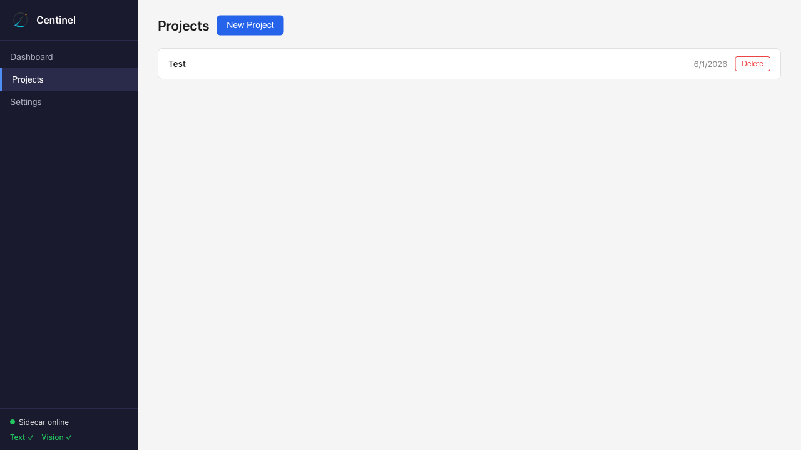
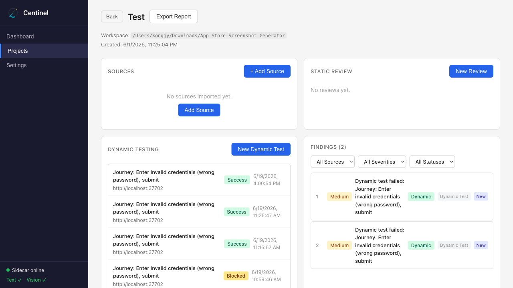
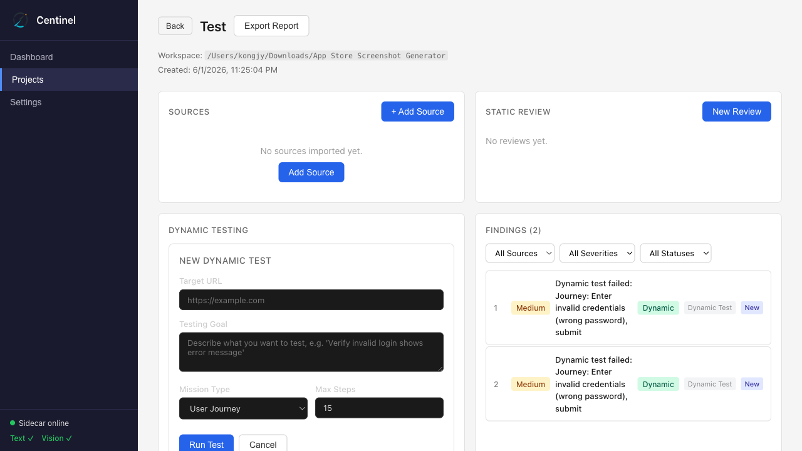
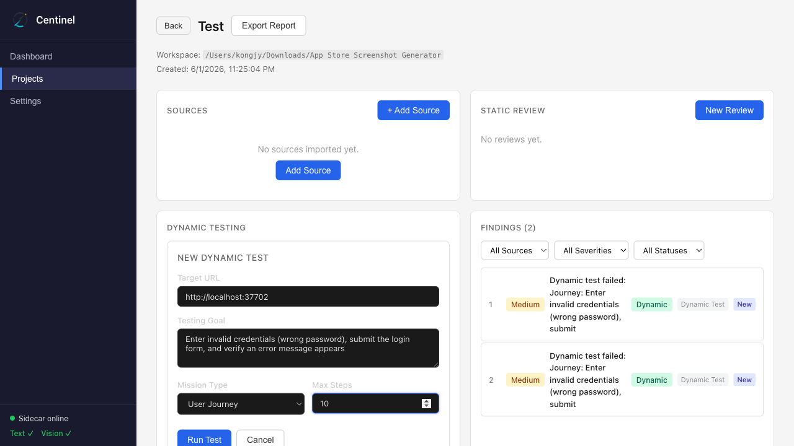
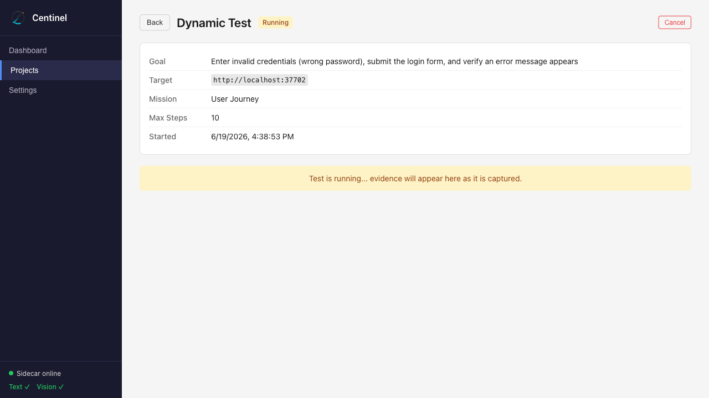
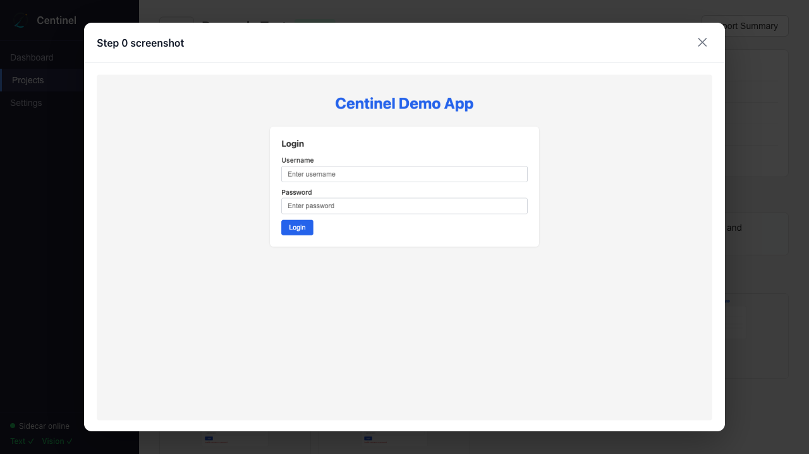
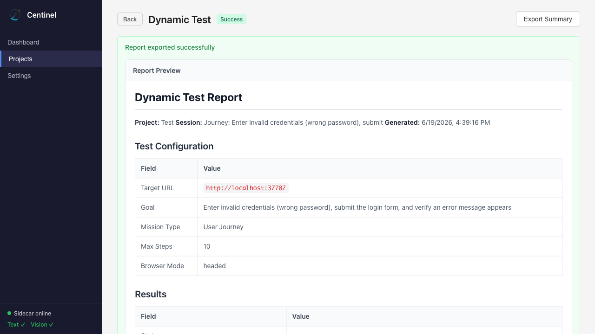

# Dynamic Module E2E Test Report

**Date:** 2026-06-19  
**Test Type:** Real E2E Test (Playwright + MiMo Vision AI)  
**Result:** ✅ PASSED

---

## Executive Summary

The Dynamic Test module was successfully validated through a complete end-to-end test flow. A real dynamic test session was created via the Centinel web UI, executed against a demo login application, and completed with **success** status. All evidence (screenshots, AI responses, action traces, debug logs) was collected and verified. The in-app Markdown report preview and export functionality worked correctly.

---

## Test Environment

| Component | Value |
|-----------|-------|
| Sidecar API | `http://localhost:37701` ✅ |
| Demo App | `http://localhost:37702` ✅ |
| Web UI (Vite) | `http://localhost:1420` ✅ |
| Vision Provider | MiMo (`mimo-v2.5`) via `api-key` header |
| Text Provider | MiMo (`mimo-v2.5-pro`) via `api-key` header |
| Browser | Chromium (Playwright) |

---

## Test Configuration

| Setting | Value |
|---------|-------|
| Target URL | `http://localhost:37702` |
| Goal | Enter invalid credentials (wrong password), submit the login form, and verify an error message appears |
| Mission Type | User Journey |
| Max Steps | 10 |

---

## Test Steps & Results

### Step 1: Service Health Check
- **Sidecar:** ✅ OK (`/health` returned `{"status":"ok"}`)
- **Vision Provider:** ✅ Configured (MiMo `mimo-v2.5`)

### Step 2: Project Discovery
- **Project:** Test (`388031df-8fc2-424e-90c4-a1ae9d8349ed`)

### Step 3: Browser Launch
- ✅ Web UI loaded at `http://localhost:1420`

### Step 4: Navigate to Project
- ✅ Clicked "Projects" → Selected "Test" project

### Step 5: Open Dynamic Test Form
- ✅ Clicked "Dynamic Test" button → Form opened

### Step 6: Fill Test Configuration
- ✅ Target URL: `http://localhost:37702`
- ✅ Goal: `Enter invalid credentials (wrong password), submit the login form, and verify an error message appears`
- ✅ Mission Type: User Journey
- ✅ Max Steps: 10

### Step 7: Submit Test
- ✅ Clicked "Run Test" → Session created

### Step 8: Session Created
- **Session ID:** `f4076e86-3ee9-4370-8fca-093c56793417`
- **Initial Status:** `running`

### Step 9: Wait for Completion
- ✅ Session completed with status: **`success`**

### Step 10: Verify Evidence
- ✅ **All required evidence types present**
- Total evidence items: **20**

| Evidence Type | Count |
|---------------|-------|
| screenshot | 6 |
| ai_request | 5 |
| ai_response | 5 |
| action_trace | 1 |
| console_log | 1 |
| debug_log | 1 |
| session_summary | 1 |

### Step 11: Screenshot Modal
- ✅ Found 6 clickable screenshots
- ✅ Modal opens on click
- ✅ Escape key closes modal

### Step 12: Export Functionality
- ✅ "Export Summary" button clicked
- ✅ Export completed successfully
- ✅ Markdown report preview rendered in-app
- ✅ File path displayed with "Copy Path" button
- ✅ Report file exists on disk

### Step 13: Final Session Details
- **Status:** `success`
- **Summary:** Test passed: Successfully verified invalid credentials flow: entered test username 'testuser' with incorrect password, submitted the form, and confirmed error message appears.

---

## Evidence Structure

```
<App Store Screenshot Generator>/sessions/f4076e86-3ee9-4370-8fca-093c56793417/
├── screenshots/
│   ├── step-000.png          # Initial page state
│   ├── step-001.png          # After first action
│   ├── step-002.png          # After second action
│   ├── step-003.png          # After third action
│   ├── step-004.png          # After fourth action
│   └── final.png             # Final page state
├── ai/
│   ├── step-000-request.json
│   ├── step-000-response.json
│   ├── step-001-request.json
│   ├── step-001-response.json
│   ├── step-002-request.json
│   ├── step-002-response.json
│   ├── step-003-request.json
│   ├── step-003-response.json
│   ├── step-004-request.json
│   └── step-004-response.json
├── logs/
│   ├── session-debug.json    # Complete debug log
│   ├── action-trace.json     # Structured action log
│   └── console.json          # Browser console output
└── summary.md                # Human-readable summary
```

---

## Exported Report

**File Location:**  
```
/Users/kongjy/Downloads/App Store Screenshot Generator/reports/dynamic-test-Journey--Enter-invalid-credentials--wrong-password---submit-2026-06-19T08-39-16.md
```

**Report Contents:**
- Test Configuration (target URL, goal, mission type, max steps)
- Results (status, timestamps, summary, failure reason)
- Evidence Summary (counts by type)
- Action Trace (step-by-step execution table)
- Screenshots (list with file names)
- AI Communication (request/response counts)
- Console Logs (file path reference)
- Debug Log (file path reference)

---

## Screenshots

### 1. Projects Page


### 2. Project Detail


### 3. Dynamic Test Form


### 4. Form Filled


### 5. After Submit


### 6. Screenshot Modal


### 7. Export Result


---

## Pass Criteria Verification

| Criteria | Status |
|----------|--------|
| Dynamic test completes with terminal status | ✅ `success` |
| Invalid-login demo achieves expected result | ✅ AI detected error message |
| Evidence is enough to reproduce what happened | ✅ 20 evidence items |
| Screenshots load through `/evidence-file` | ✅ All 6 screenshots display |
| Exported report includes test configuration | ✅ |
| Exported report includes result and status | ✅ |
| Exported report includes evidence summary | ✅ |
| Exported report includes action trace | ✅ |
| Exported report includes screenshot list | ✅ |
| Exported report includes AI communication counts | ✅ |
| Exported report includes console/debug log references | ✅ |
| Frontend build remains passing | ✅ |
| In-app Markdown report preview renders | ✅ |

---

## Phase 3 Completion Checklist

| Feature | Status |
|---------|--------|
| Dynamic session export (`exportDynamicSessionReport`) | ✅ |
| API endpoint `POST /projects/:id/dynamic-sessions/:sid/report` | ✅ |
| Backend returns `{ reportPath, markdown }` | ✅ |
| Evidence file serving (`/evidence-file`) with validation | ✅ |
| Structured debug logging (`session-debug.json`) | ✅ |
| Vision model retry (3 attempts with backoff) | ✅ |
| JSON repair attempt | ✅ |
| Action retry (2 attempts) | ✅ |
| Failure categories | ✅ |
| Accessibility fields in context extraction | ✅ |
| Screenshot click-to-enlarge modal | ✅ |
| Export button with Markdown preview | ✅ |
| `thinking: { type: 'disabled' }` for MiMo | ✅ |
| Provider presets (MiMo, Gemini, Custom) | ✅ |
| `api-key` header for MiMo provider | ✅ |
| E2E test passed | ✅ |

**Phase 3 is complete.**

---

## Notes

- All API calls were real (MiMo `mimo-v2.5` for vision, `mimo-v2.5-pro` for text)
- The AI agent successfully navigated the demo login page, entered invalid credentials, submitted the form, and detected the error message
- Session completed in approximately 1-2 minutes
- The dynamic test achieved `success` status on its first attempt
